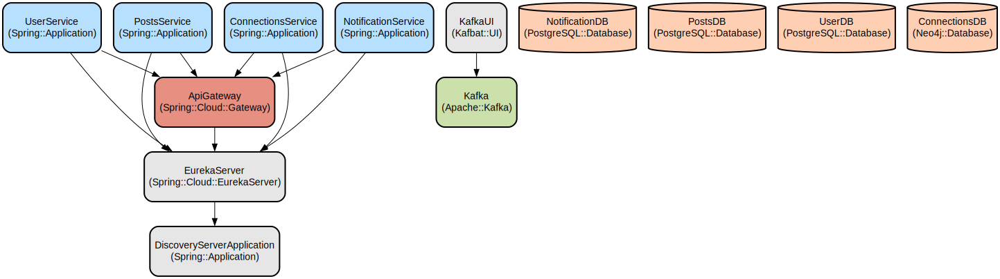

# LinkedIn Clone: A Microservices-based Social Network Platform

A Spring Boot-based microservices architecture that implements core LinkedIn functionality with service discovery, API gateway, user management, and post handling capabilities. The platform provides a scalable and maintainable foundation for building a professional social networking application.

This project demonstrates modern microservices patterns using Spring Cloud components, including Eureka for service discovery, Spring Cloud Gateway for API routing, and independent services for user management and post handling. The architecture enables horizontal scalability, resilience, and independent deployment of services while maintaining a cohesive user experience.

## Repository Structure
```
.
├── api-gateway/                 # API Gateway service for routing and load balancing
│   ├── src/                    # Source code for API gateway implementation
│   └── pom.xml                 # Maven configuration for API gateway
├── discovery-server/           # Eureka server for service discovery
│   ├── src/                    # Source code for discovery server
│   └── pom.xml                 # Maven configuration for discovery server
├── post-service/              # Microservice for post management
│   ├── src/                    # Source code for post service
│   │   └── main/java/         # Java source files
│   │       └── controller/    # REST controllers for post operations
│   │       └── service/       # Business logic implementation
│   │       └── repository/    # Data access layer
│   └── pom.xml                # Maven configuration for post service
└── user-service/             # Microservice for user management
    ├── src/                    # Source code for user service
    │   └── main/java/         # Java source files
    │       └── controller/    # REST controllers for user operations
    │       └── service/       # Business logic implementation
    │       └── repository/    # Data access layer
    └── pom.xml                # Maven configuration for user service
```

## Usage Instructions
### Prerequisites
- Java Development Kit (JDK) 21
- Maven 3.9.9 or later
- PostgreSQL 12 or later
- Git

### Installation

1. Clone the repository:
```bash
git clone <repository-url>
cd linkedin-clone
```

2. Start the Discovery Server:
```bash
cd discovery-server
./mvnw spring-boot:run
```

3. Start the API Gateway:
```bash
cd ../api-gateway
./mvnw spring-boot:run
```

4. Start the User Service:
```bash
cd ../user-service
./mvnw spring-boot:run
```

5. Start the Post Service:
```bash
cd ../post-service
./mvnw spring-boot:run
```

### Quick Start

1. Register a new user:
```bash
curl -X POST http://localhost:8080/api/v1/users/signup \
-H "Content-Type: application/json" \
-d '{"name":"John Doe","email":"john@example.com","password":"password123"}'
```

2. Login to get JWT token:
```bash
curl -X POST http://localhost:8080/api/v1/users/login \
-H "Content-Type: application/json" \
-d '{"email":"john@example.com","password":"password123"}'
```

3. Create a post:
```bash
curl -X POST http://localhost:8080/api/v1/posts \
-H "Content-Type: application/json" \
-H "Authorization: Bearer <your-jwt-token>" \
-d '{"content":"Hello LinkedIn!"}'
```

### More Detailed Examples

1. Get user posts:
```bash
curl http://localhost:8080/api/v1/posts/user/{userId} \
-H "Authorization: Bearer <your-jwt-token>"
```

2. Like a post:
```bash
curl -X POST http://localhost:8080/api/v1/posts/likes/{postId} \
-H "Authorization: Bearer <your-jwt-token>"
```

### Troubleshooting

1. Service Discovery Issues
- Error: "Cannot register with Eureka"
- Solution: Ensure Eureka server is running on port 8761
- Check logs: `discovery-server/logs/spring.log`

2. Database Connection Issues
- Error: "Could not connect to PostgreSQL"
- Solution: Verify database credentials in application.properties
- Check database status: `pg_isready -h localhost -p 5432`

3. Authentication Issues
- Error: "Invalid JWT token"
- Enable debug logging: Add `logging.level.org.springframework.security=DEBUG`
- Verify token expiration and signature

## Data Flow
The application follows a microservices architecture with API Gateway routing requests to appropriate services.

```ascii
Client -> API Gateway (8080) -> [User Service (9020) / Post Service (9010)]
                    |
                    v
            Discovery Server (8761)
```

Key component interactions:
1. Client requests are routed through API Gateway
2. API Gateway discovers services through Eureka
3. User Service handles authentication and user management
4. Post Service manages post creation and interactions
5. Services communicate via REST APIs
6. JWT tokens ensure secure communication
7. PostgreSQL stores user and post data

## Infrastructure


### Discovery Server
- Eureka Server: Service registry and discovery
- Port: 8761
- Spring Cloud Netflix Eureka Server

### API Gateway
- Spring Cloud Gateway
- Port: 8080
- Routes:
  - /api/v1/users/** -> USER-SERVICE
  - /api/v1/posts/** -> POSTS-SERVICE
  - /api/v1/connections/** -> CONNECTIONS-SERVICE

### User Service
- Port: 9020
- PostgreSQL Database
- JWT Authentication
- User Management APIs

### Post Service
- Port: 9010
- PostgreSQL Database
- Post Management APIs
- Like functionality